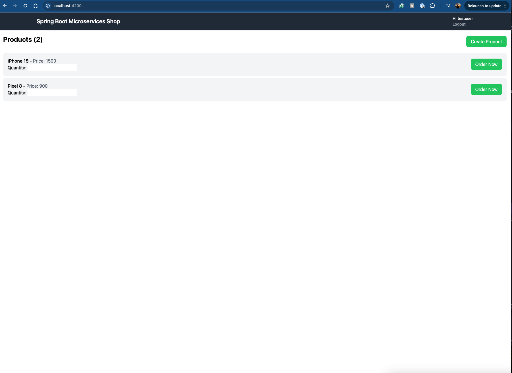
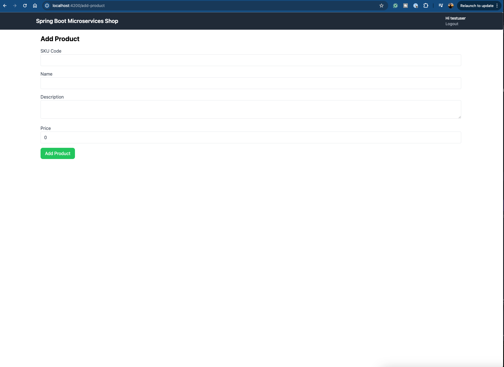

# MicroservicesShopFrontend

This project was generated with [Angular CLI](https://github.com/angular/angular-cli) version 18.0.2.

## Development server

Run `ng serve` for a dev server. Navigate to `http://localhost:4200/`. The application will automatically reload if you change any of the source files.

## Screenshots

Home Page

Add Product page

If you are seriously want to run this app and have issues with configuration of keycloak text me in Telegram(link in bio)

